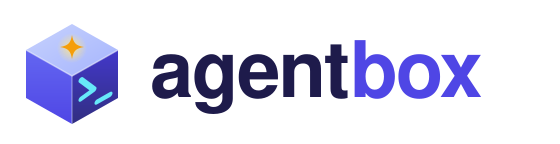

<p align="center">
  <picture>
    <source media="(prefers-color-scheme: dark)"
      srcset="docs/assets/agentbox-logo-dark.svg">
    
  </picture>
</p>

<p align="center">
  <strong>Let AI coding agents run at full speed, in a box you control.</strong>
</p>

<p align="center">
  <a href="LICENSE"></a>
  
  
</p>

agentbox runs AI coding agents (Claude Code, Codex, Pi, and local or hosted
open models) inside Docker sandboxes. You say which folders, websites,
secrets, and MCP tools a box may use. The box blocks everything else, and
one command proves it.

## Who is this for?

- **You let agents work unattended.** You want to use
  `--dangerously-skip-permissions` or auto-approve, but not on your whole
  laptop.
- **You work on several projects or for several clients.** Each project
  gets its own box, its own tokens, and its own network rules. One project
  never sees another project's credentials.
- **You run agents on a schedule.** Nightly triage, weekly dependency
  updates, morning reports: `agentbox schedule add` runs them headless
  and records every result.
- **You mix subscriptions and open models.** Use your Claude and ChatGPT
  subscriptions (no API keys), your local Ollama models, or your own
  models on Modal, from the same box.
- **You want MCP tools without handing over the keys.** The agent calls
  tools through a gateway; the tokens stay in the gateway.

## Why use it?

An agent with permission to "just do it" can read `~/.ssh`, your cloud
credentials, and every environment variable. It can push to any repository
your token reaches and send data to any website. A prompt injection in a
web page, a README, or a tool result can make it do these things. agentbox
changes the default from "everything unless denied" to "nothing unless
allowed":

- **Files:** the agent sees only the folders you mount. Credential and
  system folders cannot be mounted.
- **Network:** traffic goes out only through a proxy with an allowlist, and
  every request is logged. `agentbox denied` shows what was blocked, and
  `agentbox allow` fixes it without a restart.
- **Secrets:** they stay in your macOS Keychain. Each container gets only
  the secrets it needs.
- **Proof:** `agentbox doctor` tests every isolation property in the
  running box. It does not rely on the configuration.

Setup takes a few minutes; after that, `agentbox claude` in a project folder
starts a sandboxed session in about two seconds.

## Security model

The adversary is the agent itself: prompt injection, a malicious dependency,
or a wrong tool call. The box keeps these properties against it:

- **T1 Files.** The agent sees only the host paths that the profile mounts.
  It writes only to mounts with `mode = "rw"`.
- **T2 Network.** All traffic goes through an egress proxy. In `strict` mode
  (default) the agent reaches only allowlisted domains. The proxy always
  blocks IP addresses, private ranges, the host, and cloud metadata.
- **T3 Host control.** The box has no Docker socket, no host network, no
  privileged mode, and no Linux capabilities. The agent is not root.
- **T4 Secrets.** A box gets only the secrets that its profile gives to it.
  Keys for model routers and MCP servers stay in those sidecars.
- **T5 MCP.** The agent reaches MCP servers only through one gateway. The
  gateway allows only the servers and tools in the profile and logs each
  call.
- **T6 Boxes.** Boxes of different profiles cannot reach each other.

Read [docs/SECURITY.md](docs/SECURITY.md) for the enforcement of each
property and for the risks that agentbox accepts.

## Quick start

```sh
uv tool install -e ./cli
claude setup-token
agentbox setup
agentbox init myproject --mount ~/Projects/myproject
cd ~/Projects/myproject
agentbox claude
```

Read [docs/USAGE.md](docs/USAGE.md) for each step and for all other tasks.

## Example: a scheduled daily news brief

[examples/news-brief](examples/news-brief/README.md) is a complete project
to learn agentbox with. Each weekday, Claude gets the news through the
Perigon MCP server, writes a brief, renders it to PDF, and sends it to
Slack. The guide takes you through secrets, the MCP gateway, the network
allowlist, headless runs, scheduling, and `agentbox doctor`, step by step.

## Requirements

- macOS with Docker Desktop, or Linux with Docker Engine and Compose v2.
- `uv`, and Python 3.11 or later for the host CLI (stdlib only).
- Free disk space for the images: the agent image is about 1.6 GB, the
  optional router image about 2 GB, and the build downloads more.
- A Claude subscription for Claude Code. A ChatGPT subscription for Codex
  and Pi (optional).
- Host Ollama 0.14.0 or later for local models (optional).

## Status and limits

- The main test host is macOS on Intel (x86_64) with Docker Desktop. The
  images are amd64 only.
- Linux is a secondary target. The Linux CI workflow is in the repository,
  but it has not run yet. Linux is not tested.
- On Linux, the default secret backend (macOS Keychain) is not available.
  Use the 1Password backend (`op`).
- Host tools (git, VS Code, direnv, npm, make) that you run in a writable
  mount can run files that the agent planted there. Read "Running host
  tools in a mounted folder" in [docs/SECURITY.md](docs/SECURITY.md).
- The box does not stop exfiltration to an allowed domain. Read the
  residual risks in [docs/SECURITY.md](docs/SECURITY.md).

## Links

- [docs/USAGE.md](docs/USAGE.md): install, profiles, and all commands.
- [docs/SECURITY.md](docs/SECURITY.md): threat model and residual risks.
- [docs/PLAN.md](docs/PLAN.md): design and phase plan.
- [profiles/example.toml](profiles/example.toml): an example profile.
- [examples/news-brief](examples/news-brief/README.md): guided example
  project (MCP server, PDF, Slack, schedule).

## License

MIT. Read [LICENSE](LICENSE).
